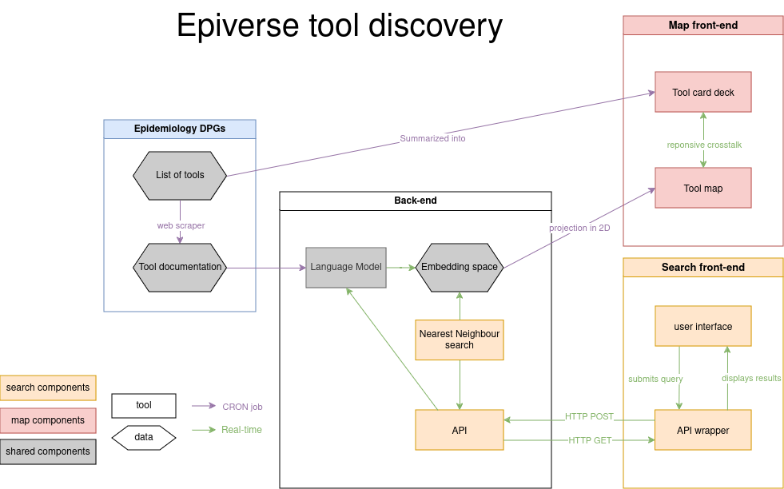

# Epiverse visual map

## User persona & user story

This work is mostly targeted at the following persona:

- Pandemic & Epidemic Intelligence tool implementer
- Pandemic & Epidemic Intelligence tool creator
- Domain expert

with the following user story:

> I want to quickly & visually understand what Epiverse is about, and its niche in the ecosystem of data science tools for Epidemiology

## Design options and user feedback

3 options have been identified to address the user stories:
<table style="width:99%;">
<colgroup>
<col width="7%" />
<col width="27%" />
<col width="25%" />
<col width="39%" />
</colgroup>
<thead>
<tr class="header">
<th>Solution</th>
<th>Benefits</th>
<th>Limitations</th>
<th>Examples</th>
</tr>
</thead>
<tbody>
<tr class="odd">
<td>cards</td>
<td><ul>
<li>More details on specific packages</li>
</ul></td>
<td><ul>
<li>Does not explicit links between packages</li>
</ul></td>
<td><ul>
<li>
<a href="https://epiverse-trace.r-universe.dev">r-universe</a>
</li>
<li>
<a href="https://ropensci.org/packages/image-processing/">rOpenSci</a>
</li>
</ul></td>
</tr>
<tr class="even">
<td>network</td>
<td><ul>
<li>Explicit interactions &amp; relations between packages</li>
</ul></td>
<td><ul>
<li>
Does not much give info on individual packages
</li>
<li>
May be difficult to automate link definition
</li>
</ul></td>
<td><ul>
<li><a href="https://github.com/epiverse-connect/NetworkViz">Original
Epiverse-Connect</a></li>
</ul></td>
</tr>
<tr class="odd">
<td>map</td>
<td><ul>
<li>
Can be fully automated
</li>
<li>
Clarify package scope
</li>
</ul></td>
<td><ul>
<li>Does not explicit interactions between packages</li>
</ul></td>
<td><ul>
<li><a href="https://anvaka.github.io/map-of-github/">Map of
GitHub</a></li>
</ul></td>
</tr>
</tbody>
</table>

These three options, with their pros and cons have been presented to a panel of potential users and they recommended moving forward with a hybrid of the network and cards options.

The network is a good way to get a quick high-level overview of the ecosystem, and Epiverse position in the ecosystem. The cards allow us to see the details of each package.

## Requirements

The tool should:

- represent R packages from [the CRAN Task View in Epidemiology](https://github.com/cran-task-views/Epidemiology) as nodes of the network
- highlight Epiverse packages in a different color
- allow clicking on a node to see the details of the package via a card. The card should display:
  - the package name
  - the package logo (if it exists)
  - the package description
  - a clickable link to the documentation website (if it exists)
  - a clickable link to the GitHub repository (if it exists)
- provide a scientifically informative overview of the ecosystem (package grouped by typical user, epidemiology subdomain, etc.)

## Architecture

## Deployment

This will be part of the https://epiverse-trace.github.io/ website.
As a consequence, the final user interface should be a webapp, embeddable in a simple static website hosted on GitHub Pages.

The app also needs to be redeployed every week, or at least every month, using the new data (new packages and new data about existing packages).

## Previous and related work

- https://github.com/epiverse-connect/NetworkViz, creating a network of packages, and external data sources, based on manual input of interoperability level
- https://github.com/epiverse-connect/dashboard, creating a network of packages from the Task View based on their dependency relationships
